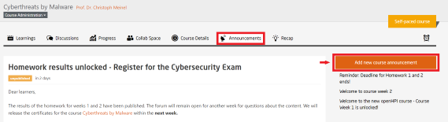
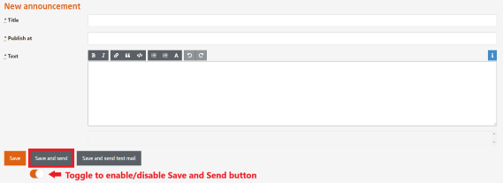

# Course Announcements

Course administrators and teaching team members are required to publish course announcements at the start of every course weeks. They also need to keep the participants updated with every changes that occurs in the course by using the **Announcement** tab as shown in the figure below:  

  
*Fig. Course announcement tab for a specific course*  

Before every deadlines, quizzes or examinations, course administrators should make an announcement informing the details.  

To make an announcement, you have to click on the **Announcements** tab on a particular course page and click on **`Add new course announcement`** as shown in the image above.  

You will be redirected to the blank course announcement page as shown in the image below:  

  
*Fig. Make an announcement*  

In the page shown in the picture above, the following text boxes have to be filled:  

- **Title** - Give a title to your announcement
- **Publish at** - Set a date whenever the announcement have to be published
- **Test** - Write the contents of your announcement

Below the page you will find three command buttons:  
- **Save** - Your announcement will be saved but will not be sent
- **Save and send** - Your announcement will be saved and sent
- **Save and send test mail** - Your announcement will be saved but will not be sent, however, the announcement will be sent to your email (or whoever is writing the announcement). If you are happy with the announcement, click **`Save and send`**