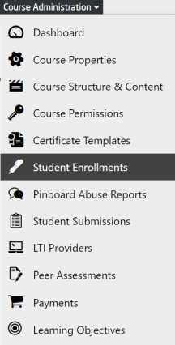
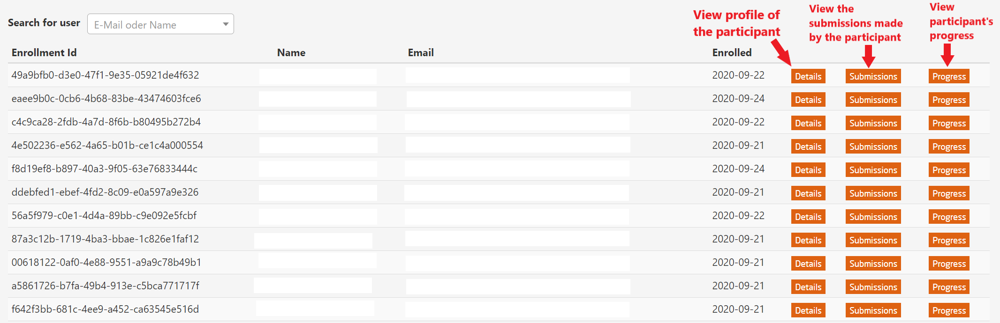
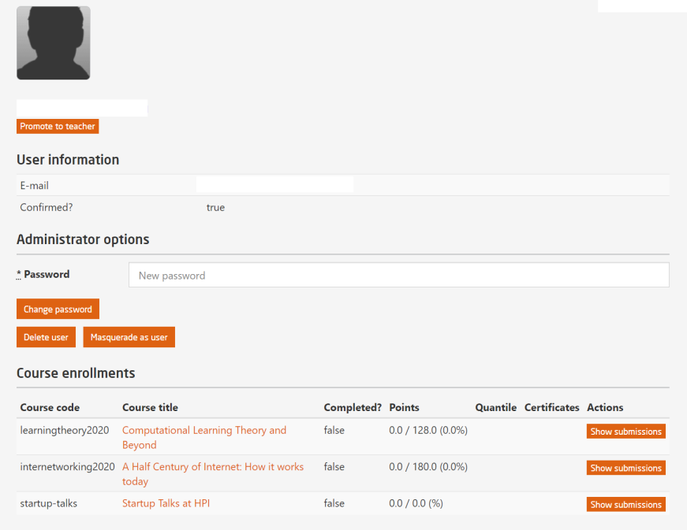
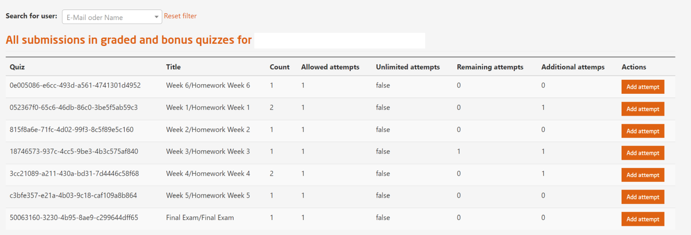
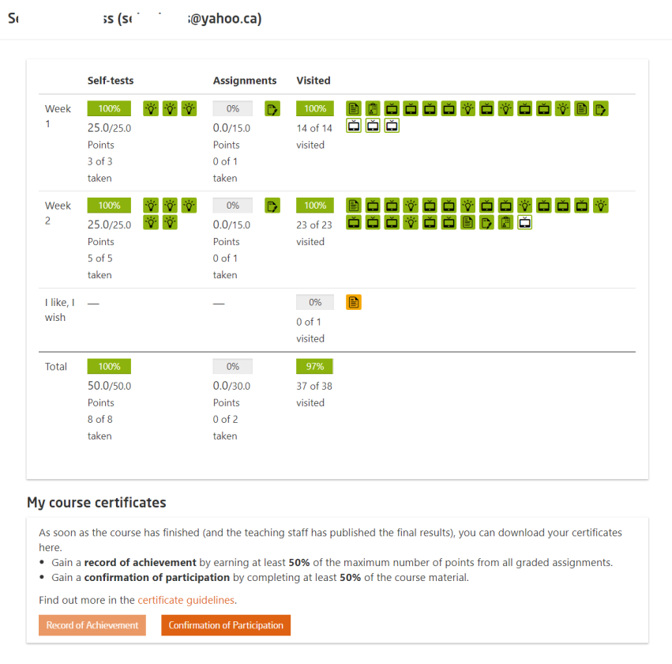

# Student Enrollments

Course administrators have the permission to manage enrolled participants of their course via the openHPI platform.

  
*Fig. To manage all the enrolled participants in the course*  
   

  
*Fig. Preview of the student enrollment page where all the enrolled participants in a course are listed*  
   

In the student enrollment page, course administrators can perform the following operations:  

* Manage the profile of a participant  
  
    
*Fig. Details of a participant*  
   

* Manage all the submissions in graded and bonus quizzes for individual participants  
  
    
*Fig. Preview of the submission details of a participant*  
 

* Check the progress details of a participant  
  
    
*Fig. Preview of a participant's progress in the course*  
 