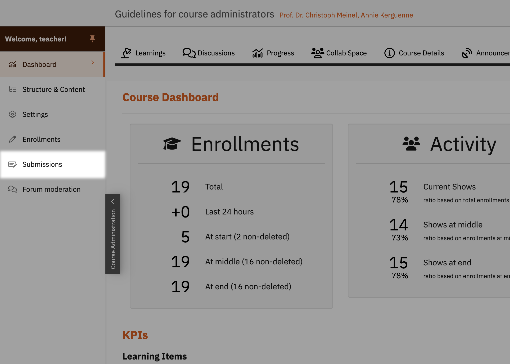
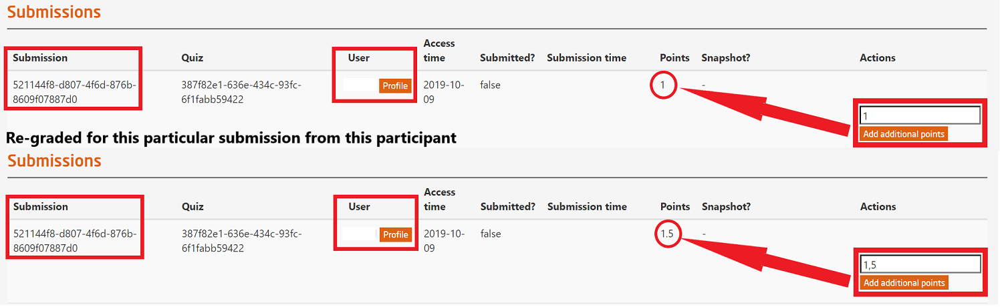

# Student Submissions

Course administrators have the permission to manage and check the submissions in graded and bonus quizzes for all the enrolled participants via the openHPI platform.  

  
*Fig. To manage the submissions of all participants in the course*  
 

This page provides an overview on the students submissions. Teaching team members can search for particular solutions by certain students for trouble-shooting. If necessary, additional points can be added to certain submissions by particular students e.g. to compensate points that are missing due to technical issues:  

  
*Fig. Preview of the student submissions page*  

Please follow the illustrated example below on how to regrade target submissions. Please note that this is not a platform-wide regrading but only for the particular submission from a specific participant.  

  
*Fig. Example of re-grading a particular submission of a target participant*  

To allow additional attempts, please click at the **`user's name`** on the page shown above in the figure. This will lead to the following page as mentioned below:   

  
*Fig. On this page, you can allow an additional attempt to the selected participant*  
   

### Teaching staff are advised to consult the platform administrator before awarding any additional points or attempts.
