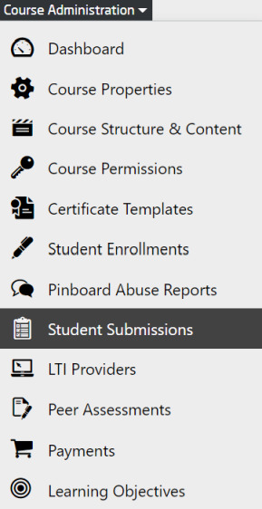
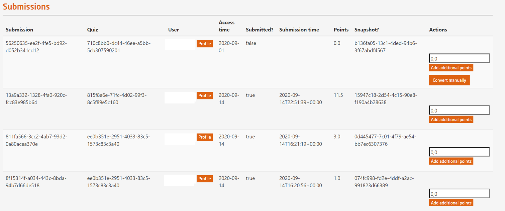

# Student Submissions

Course administrators have the permission to manage and check the submissions in graded and bonus quizzes for all the enrolled participants via the openHPI platform.  

  
*Fig. To manage the submissions of all participants in the course*  
 

  
*Fig. Preview of the student submissions page*
