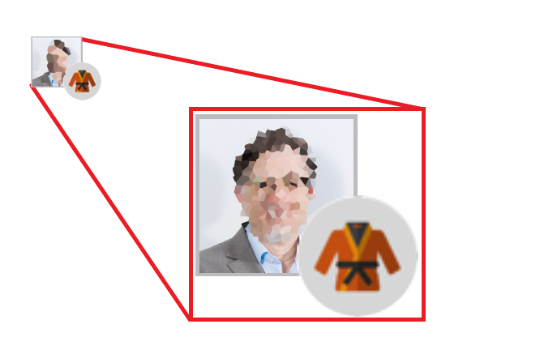

# Discussion Forum

The discussion forum posts are automatically placed in the module that the participant is currently attending.  

  
*Fig. Discussion Forum tab for the participating course*  

The course-wide discussion forum offers the following opportunities:  
* Participants can ask questions 
* Begin discussions with the other participants
* Ask questions to the teaching team at any time

  
*Fig. Sample preview of the discussion forum*  

Questions and discussions can also be directly assigned to a video.  
Participants can tag posts or assign them to specific topics or terms, and thereby making them easier to find.  

Specific posts can be configured by the teaching team as ***sticky*** which ensures that important information is always located at the top of the list.  
All participants can vote for questions and answers (in each case, one vote per participant and question/answer).  
The one who has posed the question can mark an answer as correct (in the sense of ***especially helpful***).  

Participants are given the option of reporting deficient forum contributions.  
After the post has been reported three times, it is automatically blocked and submitted to the teaching team for evaluation.  
The teaching team can then decide whether the post should be permanently blocked or released again.  
It is also possible for the teaching team to block posts independently of participants’ reports. In this case, blocked posts are only visible to the teaching team.  

To support active participation in the forum, the system rewards so-called ***eXperience Points*** (XP).  
Participants receive these points for especially high-quality contributions (answers with many positive reviews or ones that are marked as correct).  
Participants who have exceeded a certain threshold of XP, receive recognition in the forum with the reward of a ***judo belt***.  
The bigger the number of XP, the higher the grade of the judo belt.  

  
*Fig. Sample preview of the judo belt*  

Thus, the XP and judo belt serve as ways to reflect a participant’s status.
