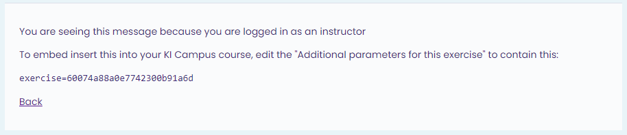
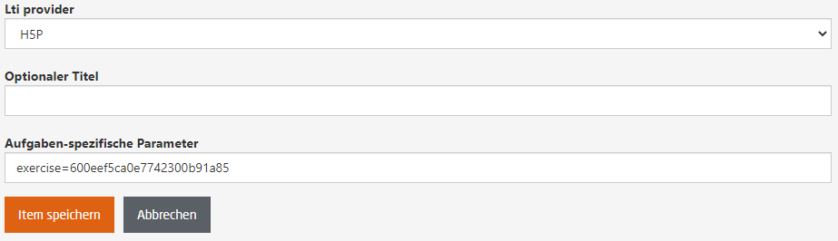
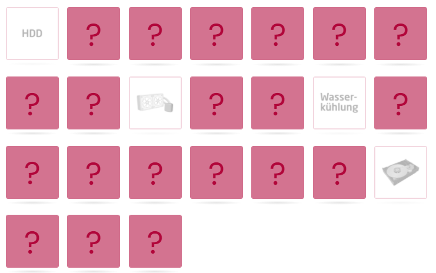
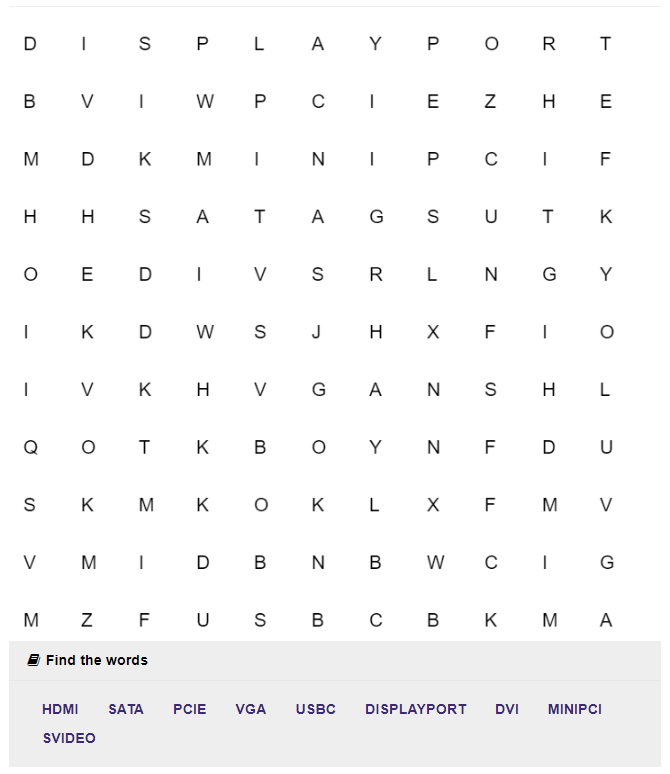
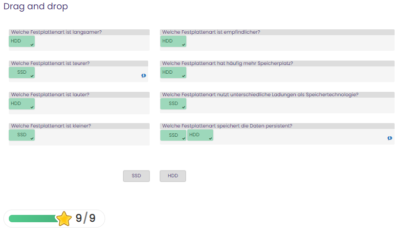
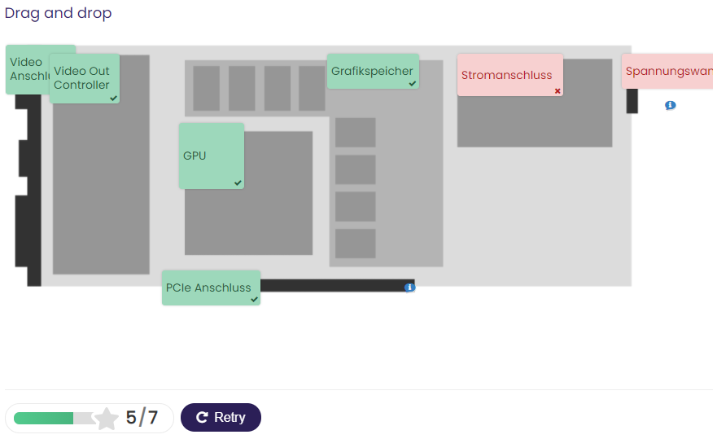
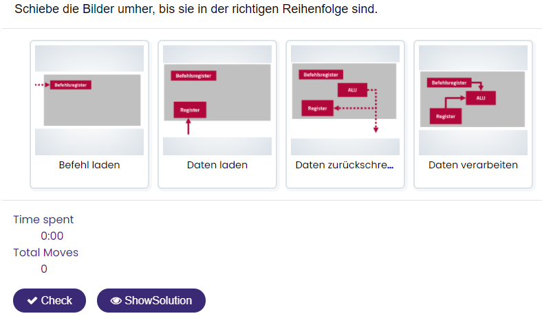
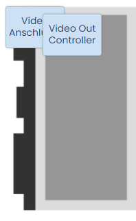
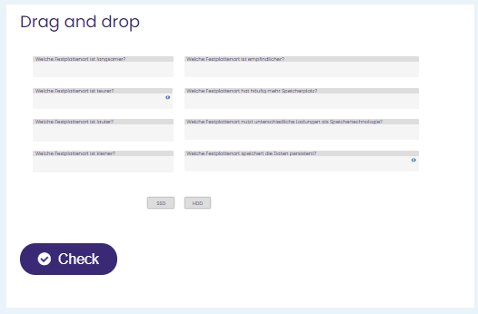
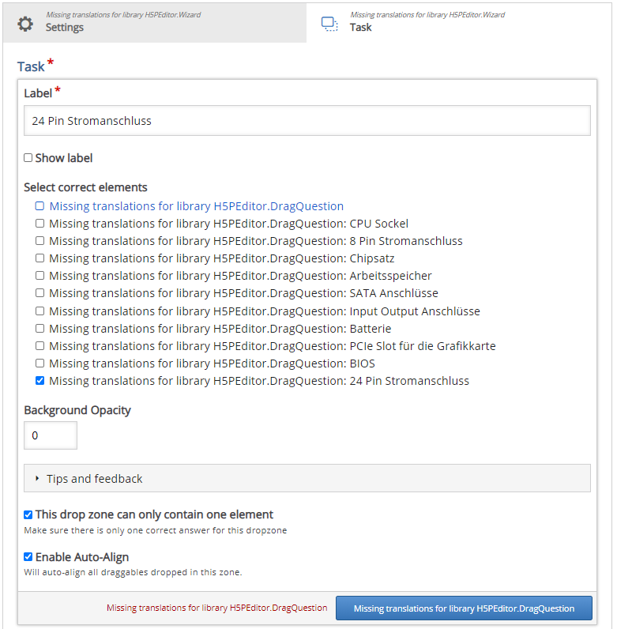

# H5P 

H5P is an open source library which delivers interactive html content. It can be embedded through iframes and also offers integrations for different platforms (e.g. moodle). Currently, it is mainly used for educational content.

## Introduction 
H5P delivers interactive content that can be embedded in various ways into the platform. Its main feature is the interactive content types. Examples are: Drag and Drop, Fill in the Blanks, Find the Hotspot and Interactive Video. These content types can be used to either show something in an interactive way or to create a quiz.
Interactive quizzes are currently an addition to the openHPI platform and make it possible to have an interactive self-check for the participants. However, this cannot be used for final exams due to the fact that the answers can be seen in the source code of the website.
### Availability
H5P is a free open-source project under the MIT license. The source code can be found [here](https://github.com/h5p). The project is currently funded by a company called Joubel which is an open-source company. H5P aims to be community-driven. Therefore, a part of the development is outsourced to the community. It is unclear how long the funding is secured but it is used by some other universities and has available plugins for different learning platforms like moodle. The website can be found under [h5p.org](https://h5p.org/).

## How to use it
1. **(Create Lti Provider)**
2. **Add the H5P Dummy to the course (placeholder on how to do that)**. 
3. **Create Content**  Execute the dummy task. You should see the Course Library. This is the section where you manage the h5p content for your course. You can create new content with the button on the top. Next, select the desired type of content. This is also the place where you can upload h5p content if you previously downloaded it. Once you selected the content type, you can add your content. Depending on the chosen type it can be text and/ or images. For the quizzes there are two sections on the bottom where you can set specific feedback for score ranges or the behavioral settings of the quiz. This allows you to define penalties, retries and other visual behavior of the task. Once the content is created you have to save the item. Now you will see the item as it is display for the participants of the course. Additionally you can see a box at the bottom that looks similar to this one:

   The last line (e.g. _exercise=60074a88a0e7742300b91a6d_ ) is the parameter which you have to enter on the create quiz site on open.hpi. You have to set the Lti provider as well. An example looks like this:
  

## Content of H5P

It is possible to use H5P for a variety of use cases. As an example it can be used to display data and interactive quizzes. The following quizzes are examples that have been used in the computeranatomie course. 

1. **Memory** You can either set the pictures to be the same or to match different pictures. In the first case the participant will have to find pairs. In the second case the participant has to find matching pictures. As long as the participant completes the memory game, full points will be rewarded. An example looks like this: 
   
 
2. **Find the words** In this quiz you can define a list of words that will be hidden in a field of letters. This will be done automatically. The words will appear in any possible way and direction in the letter field. It is possible for a word to be backwards diagonal. There are no penalties so the full points will be rewarded for finding all words. An example:
  
  
3. **Drag and Drop** In this quiz the participants drag and drop words either on marked areas over a picture or in question fields. They are not as easy to set up as the others. However it is more flexible than the other quizzes. It is possible to define which words can be dropped into which zones. Additionally the number of words per zone can be set as well. This makes the following examples possible:  

 

4. **Image Sequencing** This quiz allows you to set pictures in a correcter order. It will then mix them up for the participants. This is easy to set up and use. The example from the course looks like this: 
 

## Current problems with the tool

There are a couple of things you should be aware of when using this tool. 
1. The scaling and alignment of items is either automatic and suboptimal or it requires quite some work to do it right. In some cases questions are cut of automatically or answers might overlap each other. Furthermore the scaling is not perfect and the text might get very small or even unreadable in standard settings on small screens. Some examples look like this:

 

2. Creating the quizzes might be a lot of work in some cases. Some quizes like the memory are pretty easy and intuitive. Other quizzes such as the drag and drop are not intuitive and have some missing translations. In these cases one needs a lot of try and error to create a quizz as desired. 
  Be especially aware of this non-translated red button. You might think that this just discards the changes, but in practice it deletes the entire object. 

  A further problem is that the flexibility for the drag and drop quiz is unexpectedly good, but it needs a lot of settings in order to configure it. You can set the drop zones for each text and then specify in each drop zone which text(s) should be the correct one(s). 
  
3. In some quizzes there are small problems with attending the quiz. 
- In the find the words quiz it is very difficult to select a word in the top row because the mouse is not aligned with the selection on the word field. 
- A second problem we found is that it is also difficult to place larger texts in small drop zones in the drag and drop quiz. 
In both cases it is not impossible to successfully complete the task but it might be very annoying for the users.

## User Feedback

----------

Details are to be discussed. 
Contact: openhpi-info@hpi.de
