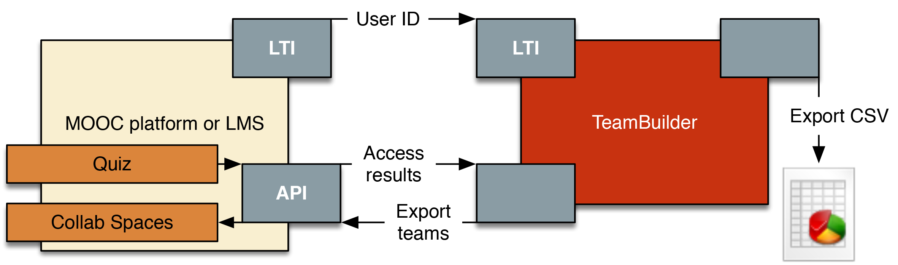

# TeamBuilder

The openHPI Platform provides a toolset that allows instructors to assign tasks to teams and evaluate and grade the work of the teams by peer assessment. This toolset consists of three components: 

- The Collab Spaces are a platform feature that provides teams and groups with an area of their own within the course. It offers a set of communication and collaboration tools, such as a private forum, a file-sharing platform, a calendar integration, and collaborative text editing features.
- The TeamBuilder is a standalone web application to form teams out of a given pool of participants, based on a variable set of parameters. It allows to limit the number of participants that will be admitted to attend the team assignments. The Team Builder can be connected to any Learning Management System (LMS) using the Learning Tools Interoperability (LTI) interface. To leverage the tool’s full power, however, a tighter integration via APIs is required.
- The Team Peer Assessment is a platform feature that allows teams to jointly submit digital artifacts. The submissions of each team are reviewed and assessed individually by the members of the other teams. Additionally, it allows the team members to rate the work of their teammates in terms of contribution, organization, and social skills.

### Availability

While the Collab Spaces and the Peer Assessment System are built-in platform features, the TeamBuilder is a standalone tool that can be connected to any LMS supporting the LTI interface (see Figure 1). 

*Connecting the TeamBuilder to an LMS*

## Features

The TeamBuilder provides a limited set of parameters to be used for the team matching process:

- The participant's preferred language 
- The participant's location or time zone 
- The participant's area of expertise 
- The participant's time commitment 
- The participant's age and gender 
- Course specific parameters

Course specific parameters might be a choice of tasks, a list of the participants' schools (i.e. to support hybrid teaching), or whatever the instructors of the course come up with. Instructors can activate the parameters in which they are interested and deactivate the others. Furthermore, they can decide in which order the matching criteria must be applied and if a parameter is to be employed homogeneously or heterogeneously.

The chosen parameter-set has to be published before the data can be collected from the participants to avoid incomplete datasets. Once the list of required parameters is published, it is no longer possible to append additional parameters.

It is possible, however, to deselect matching criteria later on if it turns out that the selected parameters will not allow to form expedient teams. It was deliberately decided to work with a relatively simple and limited dataset. The participants are only loosely coupled to the platform, and the time for matching the teams is very limited. Therefore, the participants are not asked for more personal criteria, such as personality traits, etc. All data that are asked from the participants, however, are mandatory. Those who refuse to provide the relevant piece of information, will not be considered for the team assignments. Next to the selection of matching criteria, the tool allows to dene a range of values for the desired team size. Finally, the tool allows to limit the total number of participants for the team assignments within a course. The limiter can either act on a first-come/first-serve basis, or on the participants' performance in the assignments whose deadline has passed before the team building process has started. First-come/first-serve simply allows the instructors to select the first N participants that have applied. If the instructor decides to select the eligible participants based on their results in the previous assignments, the tool allows two different settings:

1. Set a maximum amount N of participants to be admitted for teamwork. The N participants that performed best so far will be admitted. 
2. Set a lower limit for the results in the exams that has to be achieved. In addition to the total maximum number of participants, a lower limit for the results can be set. Only participants that have achieved at least X% of the points in the relevant exams but no more participants than the total maximum will be admitted. Limiting the number of participants based on the results they achieved in the previous assignments requires a tighter connection between the Team Builder and the LMS than just the LTI interface (see Figure above).

While the TeamBuilder attempts to build teams fully automated, it still allows manual corrections. Then all decisions are made by the instructors. Participants can be moved from one team to another, new teams can be created and existing ones can be removed, etc. Finally, there are two options to export the created teams. The TeamBuilder can either create a CSV file for further usage, or it can directly create Collab Spaces on the platform and add the team members to their respective Collab Space.

*The basic workflow of the TeamBuilder tool*

## Further assistance and contact

The TeamBuilder is a proprietary tool, operated and owned by the Hasso Plattner Institute. It is not part of the HPI learning platform by default but is available as an add-on to any course. If you have any questions about the usage of the TeamBuilder, please get in touch via email to discuss details. 

Contact: openhpi-info@hpi.de
