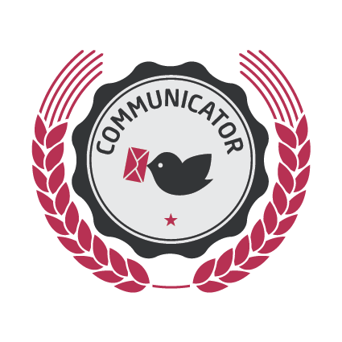

# Gamification

The platform supports some basic gamification features. Users can achieve experience points (XP) and gain badges.

## Badges  

Badges are available in three states - **Gold**, **Silver** and **Bronze**.  

Currently the following are supported:

- **Communication**: Users that are active in the forum
  

      Gold (3), Silver (8), and Bronze (13) posts (questions/answers/comments) in the forum.

- Knowledge: Users that receive good feedback (votes, accepted answers) in the forum.
  

      Gold (3), Silver (8), and Bronze (13) accepted answers in the forum.
- Self-test: Users that have solved all self-tests with a score better than 0

Badges are displayed on the user's dashboard and the user's private profile page.
All available badges are displayed here. 
As long as they are not greyed out, the user has not received the badge, it's just a placeholder.

## Experience Points

Users receive experience points (XP) for the following actions:

### Communication

- User answers a forum question: 1 XP
- User receives an upvote on a question: 5 XP
- User receives an upvote on an answer: 10 XP
- User’s answer is accepted by question author: 30 XP

### Self-tests

- User submits a 100% correct self-test for the first time: 1 XP

XPs are displayed in the top navigation (when a user is logged in) and more detailed on the user's private profile page.  

