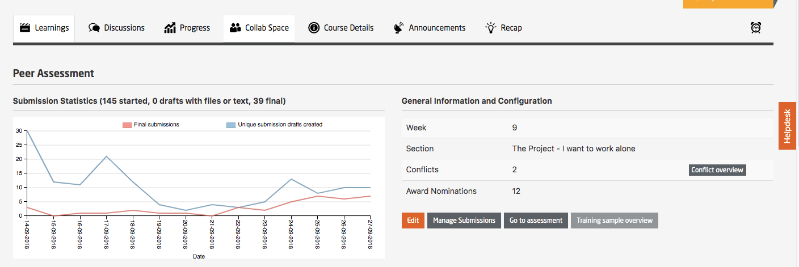
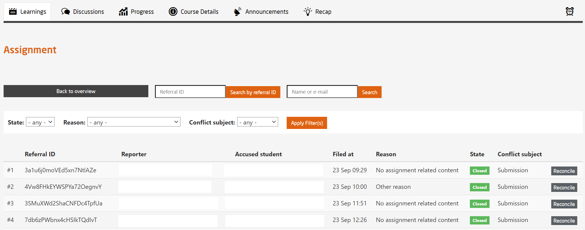
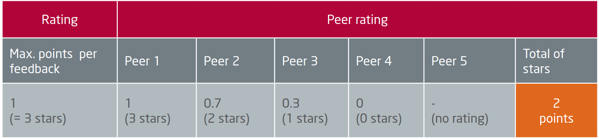

# Peer Assessment

The platform offers the possibility for participants to carry out a reciprocal evaluation for complex tasks that cannot be evaluated automatically.  

  

<i>  
Fig. Sample Peer Assessment Statistics  
</i>
  
 

The participant submits the completed task and in return receives the tasks of other participants to evaluate. The entire process is anonymous so that neither the evaluator nor the evaluee know each other.  

The submission of one’s own results as well as the assessment of the task submitted by other participants are equal parts of the assignment. Participants only receive points when they’ve completed both components.  

The evaluation of another participant’s task consists of a summative and a formative part.  

* In the summative segment the participant awards points based on specific assessment criteria.  
  
* In the formative segment the participant writes an explanation stating the reason(s) for the assessment.   

The task, the timing, and the evaluation criteria are freely configurable by the teaching team.  

<i>  
Fig. Sample Peer Review Schematic
</i>
  
 

A participant’s work is assessed by co-participants based on various evaluation criteria that have been defined by the course team. For each criterion, the median of the scores is determined by all the peers and these values are added up for all criteria.  

<i>  
Fig. Example of peer evaluation
</i>
  
 

The median is used instead of the mean (average) because it is not distorted either upwards or downwards by any extreme assessments.

* In the case of an even number of peer evaluations, the average of the two middle values will be used.  

* In case there are only two peer assessments, the average of both scores will be used.  

Participants can report submissions and reviews to the teaching team citing the reasons for them. The teaching team then has the opportunity to make a re-evaluation.  

<i>  
Fig. Sample preview of participants reporting the submissions and citing reasons for the same
</i>
  
 

Participants can rate the quality of their peers’ evaluation by awarding stars. Based on this rating, the authors of the written feedback get bonus points.    

<i>  
Fig. An example of bonus points for reviews that were rated helpful by peers
</i>
  
 

Another option is to activate an extra training phase, which allows participants to practice assessment based on sample evaluations from the teaching team.  

Additionally, another optional phase can be activated to evaluate one’s own work, after evaluating the work of the others.  
For an accurate self-assessment of one’s own work (i.e., an assessment that comes close to the evaluation of the other participants), the participant also receives bonus points.  
If the difference between the rating of the peer assessment and the participant’s self-assessment is less than 10% of the achievable score, the participants gets bonus points for an objective and accurate self-assessment (amounting to 5% of the maximum score).  

<i>  
Fig. An example of bonus points for an accurate self-assessment
</i>
  