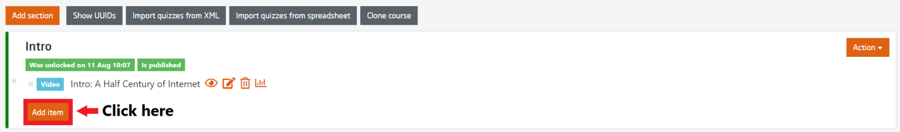
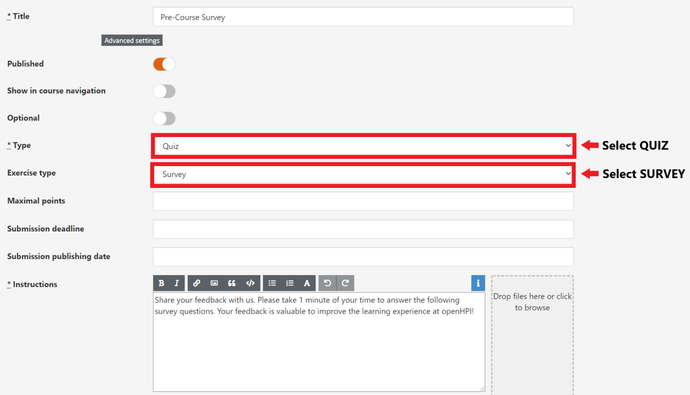
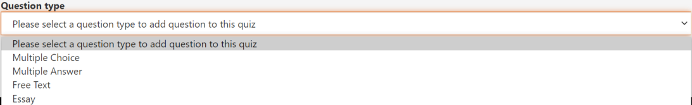

# Surveys

Surveys are optional items that can provide valuable feedback and information from the participants which might be helpful for the development of the course.  
Surveys can be added at the beginning and end of the course.  

To add survey items, please follow the illustrations shown below:  

  
*Fig. To add an item, select Course Structure & Content*  

  
*Fig. Click on the Add Item button to create an item for survey page*  
 

In the next page, select the **Type** as *Quiz* and **Exercise Type** as *Survey* as shown in the figure below:

  
*Fig. Configuration page to create a survey item*  
 
In the same configuration page, fill up all the compulsory fields including the *Title*, *Instruction*.  
You can also award some additional points to complete the survey by setting a point in the *Maximal points* field.  
 
  
*Fig. Select a question type for your survey*  
 
  
*Fig. A sample preview of the survey queestions*
