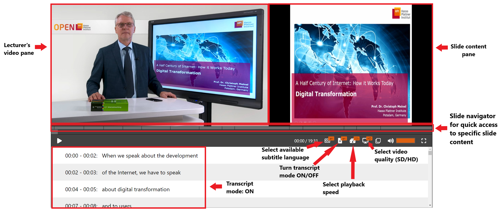
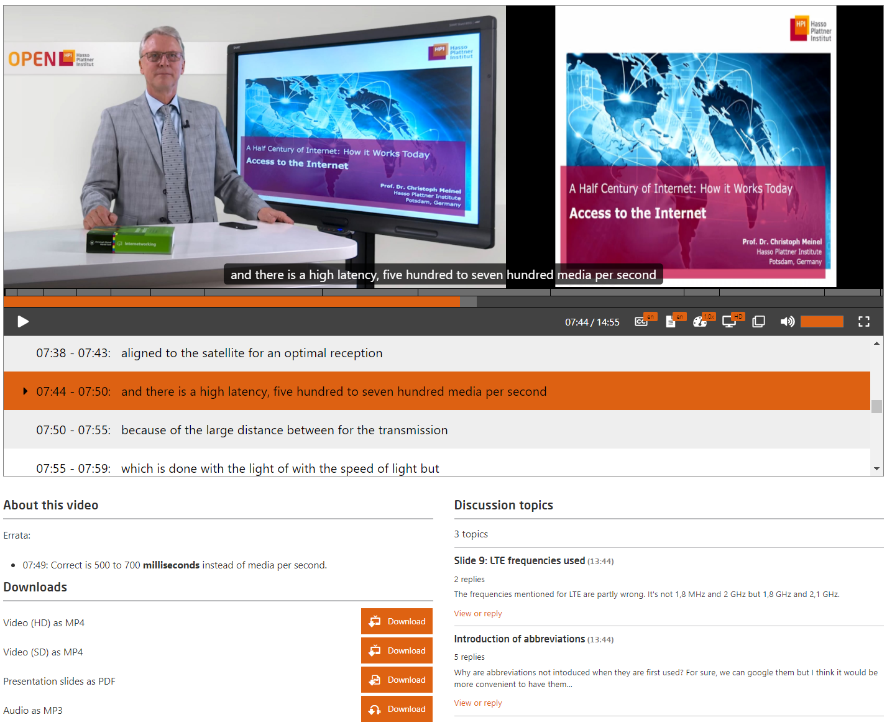

# Video

The HPI platform employs a dual-stream video player with slide navigation.  

*Fig. Sample preview of the video player*

The instructor is on one side and the presentation is on the other.   
The learner can flexibly switch between a picture-in-picture variation (preferred for mobile devices) and the dual stream variation.  
The talking speed of the speaker (video playback speed) can be adjusted flexibly.  
The accompanying slides as well as subtitles in several languages may be provided below the video.  
Furthermore, it is possible to place extra texts below the videos (e.g. errata).   

*Fig. Errata and other information can be placed below the video player including ways to download the course video (can be downloaded as audio also) and presentation slide*

Moreover, course providers, but also participants, can start discussions directly on the video playback page and ask video-related questions, which are then automatically assigned to this video and simultaneously enter the global discussion forum of the course.   
Another feature of the course is the slide navigator, which allows participants to quickly track specific content in the video.