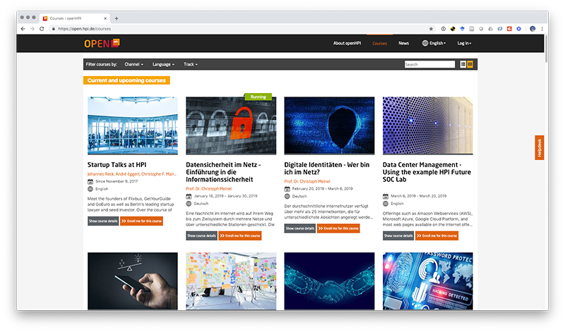

# Course List

The course list provides users with an overview of the courses on offer. These lists can be filtered, based on certain criteria.  
Channels can be created in order to clearly separate specific courses from the entire offer. The filter criteria can be configured differently for each platform instance. For example, a course can be filtered based on language and track.

*Fig. Course List*

# Courses

The largest unit of the platform are the courses. At the HPI platform, learning is provided in the form of courses. These courses are usually between two and six weeks long, have a fixed start and end date, and remain available for self-study after they are over.  

Typically, a course is configured in such a way that it is open for all platform users. However, different possibilities for limiting access to a course exist.  
The simplest option is to not display the course in the list but instead to “hide it”. Users who know the link to the course will only able to access it.  
Additionally, a course can be configured in a way that only course administrators are able to enroll participants, eliminating the possibility of self-enrollment.  
Finally, courses can be offered to a restricted group of participants.  
