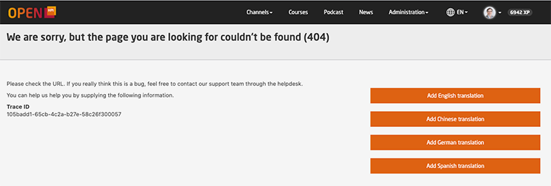
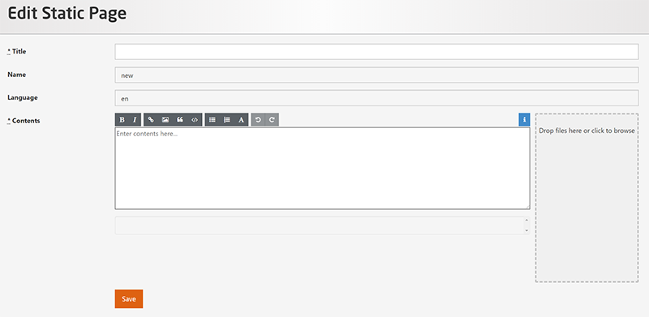

# Static Pages

As a platform administrator, you can add new static pages by the following method:

Go to the URL bar and type:
https://open.hpi.de/pages/{mypagename}

This will open a page that shows an error message (as that page doesn't exist yet) and buttons to add the new page in all available platform languages.
    

  

*Static Page*

Once you are on that page, you can add a page of your choice by clicking either of the buttons.  

The page name that you use in the URL to add the new page will be used for all translations of this page and cannot be edited.

## Add Static Page in English

After clicking on **Add English Translation** you should get this page:

  

*Edit Static Page*

You can define a new **Title** but you can not edit the **Name**  and **Language** as those are already pre-defined. Add your contents and once you are done, click **Save**.
The content can be styled using basic formatting elements in Markdown, such as lists, headlines, links, images. Alternatively you can insert HTML elements. This, however, is strongly discouraged as it offen doesn't work well in a mixed fashion and it might not necessarily be supported in our mobile apps in the future.

